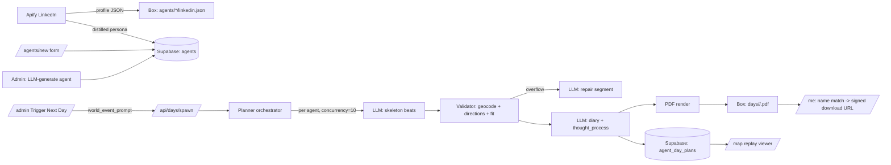

# Seaside — Engineering Document

## 1. Product overview

Seaside is a single-world human-simulation viewer. The world is populated by
~1000 agents (a mix of LinkedIn-scraped, user-created, and LLM-generated
personas) living in the Seattle metro. Time advances one **sim day** at a time;
each sim day is planned end-to-end by an LLM before it is ever shown. The
client only ever views *already-planned* days. There is no live, on-the-fly
LLM thinking during playback.

Sign-ups happen during the demo. A signed-up person fills in a short
questionnaire on `/agents/new` and the form spawns a brand-new agent in the
world. Sim days that have already happened are back-filled for that agent so
they have history. After each sim day completes, every agent gets a per-day
PDF (diary + beat-by-beat timeline + small static map) uploaded to Box. To
retrieve a PDF, a user types their first + last name on `/me` — if it matches
the agent's name exactly, the PDF download links unlock.

Hackathon requirements:

- **Apify** — LinkedIn profile / search actor for the seed population.
- **Box** — canonical store for raw Apify dumps and per-day PDFs.
- **AWS** — Bedrock for production LLM calls; Amplify for hosting.
  (Azure OpenAI is used during development; provider is one env var away.)

## 2. High-level architecture



Boundaries:

- **Supabase** owns small, queryable data: agents, sim days, plans, caches,
  users.
- **Box** owns blobs: raw Apify JSON, per-day PDFs.
- **Mapbox** owns geocoding + directions + static map images (with our own
  Postgres-backed cache to keep request volume down).
- **LLM provider** is hidden behind `lib/llm.ts`; today Azure OpenAI, swap to
  Bedrock for the hackathon judging deploy.

## 3. Data model

### 3.1 `agents` (extend existing)

| column | type | notes |
| --- | --- | --- |
| `id` | uuid | existing |
| `name` | text | existing — used as the PDF unlock key |
| `profile_pic` | jsonb | existing |
| `job_description` | text | existing |
| `location_work` | text | existing |
| `location_home` | text | existing |
| `age` | integer | existing |
| `personality` | text | existing |
| `created_at` | timestamptz | existing |
| `source` | text | new — `apify` \| `user` \| `llm` |
| `linkedin_url` | text | new — nullable |
| `linkedin_box_file_id` | text | new — nullable |
| `home_location` | jsonb | new — `[lng, lat]` resolved from `location_home` |
| `work_location` | jsonb | new — `[lng, lat]` resolved from `location_work` |

### 3.2 `sim_days`

| column | type | notes |
| --- | --- | --- |
| `id` | uuid | pk |
| `day_number` | int | unique, monotonically increasing |
| `sim_date` | date | unique, fixed virtual calendar |
| `world_event_prompt` | text | freeform; passed verbatim to every agent plan |
| `status` | text | `planning` \| `ready` \| `failed` |
| `created_at` | timestamptz | |
| `completed_at` | timestamptz | nullable |
| `failed_count` | int | how many agents fell through to fallback |

### 3.3 `agent_day_plans`

| column | type | notes |
| --- | --- | --- |
| `id` | uuid | pk |
| `sim_day_id` | uuid | fk |
| `agent_id` | uuid | fk |
| `status` | text | `pending` \| `planning` \| `ready` \| `failed` \| `reused` \| `stayed_home` |
| `attempts` | int | LLM retry counter |
| `beats` | jsonb | array of beat objects (see §3.7) |
| `diary` | text | first-person narrative for the PDF |
| `thought_process` | text | paragraph: the agent's inner monologue for the day |
| `end_state` | jsonb | `{ location: [lng,lat], energy: 0..100, notes: string }` |
| `pdf_box_file_id` | text | nullable until PDF render is done |
| `error` | text | nullable; populated on failure |
| `created_at` | timestamptz | |
| `completed_at` | timestamptz | nullable |

Unique: `(sim_day_id, agent_id)`.

### 3.4 `agent_state`

Latest-state pointer; avoids scanning history on every plan.

| column | type | notes |
| --- | --- | --- |
| `agent_id` | uuid | pk |
| `last_sim_day_id` | uuid | nullable on day 1 |
| `location` | jsonb | `[lng, lat]` |
| `energy` | int | 0..100 |
| `notes` | text | dangling threads ("didn't finish report") |
| `updated_at` | timestamptz | |

### 3.5 `places_cache`

| column | type | notes |
| --- | --- | --- |
| `query_key` | text | pk — lowercased, normalized "<place>, seattle wa" |
| `location` | jsonb | `[lng, lat]` |
| `created_at` | timestamptz | |

### 3.6 `routes_cache`

| column | type | notes |
| --- | --- | --- |
| `id` | uuid | pk |
| `from_key` | text | rounded `lng,lat` to ~10m |
| `to_key` | text | same |
| `mode` | text | `walking` \| `driving` \| `cycling` |
| `polyline` | jsonb | `[[lng,lat], ...]` |
| `duration_minutes` | int | |
| `created_at` | timestamptz | |

Unique: `(from_key, to_key, mode)`.

### 3.7 Beat shape (jsonb)

```ts
type ActivityType =
  | "commute" | "work" | "meal" | "errand"
  | "social" | "exercise" | "leisure" | "sleep" | "home"
  | "other";

type Beat = {
  index: number;
  start_time: string;          // ISO, sim time
  end_time: string;            // ISO, sim time
  activity: string;            // freeform: "Coffee with Sam at Espresso Vivace"
  activity_type: ActivityType; // used to drive weighted compression
  location_name: string;       // human-readable
  location: [number, number];  // [lng, lat] after geocode
  travel_from_prev: null | {   // null on first beat of the day
    mode: "walking" | "driving" | "cycling";
    polyline: [number, number][];
    duration_minutes: number;
  };
  reasoning: string;           // 1-sentence "why this fits me / responds to events"
};
```

Stationary types (`work`, `home`, `sleep`, `leisure`) are eligible for hard
compression in the Weighted replay mode. `commute` legs always play at full
weighted speed.

## 4. Planning pipeline

For one agent for one sim day.

```mermaid
sequenceDiagram
    participant Q as Planner
    participant LLM as LLM
    participant MB as Mapbox
    participant DB as Supabase

    Q->>DB: load agent + agent_state + last 3 diaries
    Q->>LLM: skeleton prompt (persona, yesterday end, world event)
    LLM-->>Q: 8-14 beats JSON
    Q->>MB: geocode unique destinations (cache check)
    MB-->>Q: lng/lat per place
    loop consecutive beats
        Q->>MB: directions(from, to, mode) — cache check
        MB-->>Q: polyline + duration
        Q->>Q: fit travel into gap
    end
    alt overflow detected
        Q->>LLM: repair segment X..Y (one round)
        LLM-->>Q: fixed beats
        Q->>MB: redo directions for fixed legs
    end
    Q->>LLM: diary + thought_process from final beats
    LLM-->>Q: text
    Q->>DB: insert agent_day_plans
    Q->>Q: render PDF
    Q->>Box: upload PDF
    Q->>DB: update plan.pdf_box_file_id
    Q->>DB: upsert agent_state from end_state
```

### 4.1 Skeleton prompt — required fields

- Persona: name, age, job, home, work, personality string.
- Yesterday's end: location, energy, dangling notes.
- Last 3 day diaries: short context window.
- Today's world event prompt (verbatim).
- Sim date + day-of-week.
- Output contract: strict JSON array of beats matching §3.7 minus
  `travel_from_prev` (the validator computes those) and minus `location`
  (geocoder fills it). LLM only supplies `activity`, `activity_type`,
  `location_name`, `start_time`, `end_time`, `reasoning`.

### 4.2 Validator

- For each beat, look up `location_name` in `places_cache`; on miss, geocode
  through Mapbox + store.
- For each consecutive pair, derive a `mode` from beat distance + persona hint
  (default `walking` < 1.5km, `driving` otherwise), look up the route in
  `routes_cache`; on miss, call Mapbox Directions + store.
- Compute the gap between `beat[i-1].end_time` and `beat[i].start_time`. If
  `travel.duration_minutes > gap`, flag overflow.
- Recommit timestamps so every leg fits cleanly. Push downstream beats forward
  if necessary (capped — never push past midnight; if it would, truncate the
  day instead).
- Attach `travel_from_prev` polylines.

### 4.3 Repair

Only invoked if overflow remains after trivial timestamp shifting. One round.
Prompt is narrow: "Beats N..M overflow by X minutes; rewrite just these beats
to fit." Re-run validator on the patched segment.

### 4.4 Diary + thought_process

Single LLM call with the final beat list as input. Output two fields:

- `diary` — first-person ~200 words, what the day felt like.
- `thought_process` — paragraph: the inner reasoning across the day
  (decisions, reactions to world events, mood shifts).

### 4.5 Retry / failure policy

- Each LLM call: **3 attempts**, exponential backoff (1s / 2s / 4s).
- Skeleton call exhausts all attempts → coin-flip fallback:
  - **Reuse-yesterday**: copy yesterday's beats, shift timestamps to today,
    regenerate a short "had a quiet repeat day" diary (no LLM if diary call
    also failed). Status: `reused`.
  - **Stayed-home**: synthesize a single beat (`activity_type: home`,
    location = home, all-day). Status: `stayed_home`.
- Validator failures (geocode / directions) → degrade locally: turn the
  problem beat into a stay-at-previous-location filler. Do not fail the day.
- Diary call fails → ship the plan without diary. PDF gets a placeholder
  paragraph. Map replay still works.
- Day-level: `sim_days.status = ready` as long as ≥80% of plans land in
  `ready | reused | stayed_home`. Otherwise `failed` and admin can retry.

### 4.6 Concurrency

- 10 in-flight agent pipelines (per-day fan-out).
- Each agent pipeline runs its LLM + Mapbox calls sequentially.
- Mapbox calls additionally throttled to ~5 req/sec across the whole process.

## 5. Replay viewer (`/map`)

The map page becomes a deterministic player. No live LLM calls.

UI additions on top of the existing map:

- **Day dropdown** (top-left) — lists `sim_days` with `status = ready`,
  newest first. Selecting a day loads all `agent_day_plans` for it.
- **Sim clock + scrubber + play/pause + speed (0.25–8x)** — bottom bar.
- **Compression toggle: Uniform / Weighted** — top-left.
  - Uniform: real_time = sim_minute / k for some k. Long stationary beats
    just sit on screen.
  - Weighted: travel + `commute` consume full real time; stationary beats
    (`work`, `home`, `sleep`, `leisure`) consume `min(real_duration, 3s)`.
    The clock visibly "fast-forwards" through them with a distinct UI cue.
- **Agent profile panel** (existing) extended with: today's beat timeline
  (current highlighted), the agent's `thought_process` paragraph, and an
  "Open PDF" button that links to `/me` if not yet unlocked.

Performance:

- On day select, pre-flatten each agent's beats into a single sorted
  `(time, lng, lat)` track using the polylines.
- Render loop binary-searches per agent per frame.
- 1000 dots at 30fps is fine with the existing GeoJSON source + circle layer.

## 6. PDF + Box

Per-day per-agent PDF, rendered server-side with `@react-pdf/renderer`.

Contents:

1. Header: agent name, sim date, day number.
2. First-person diary entry (~200 words).
3. Beat-by-beat timeline: start–end, activity, location.
4. Static map snapshot of the route — Mapbox Static Images API with all
   `travel_from_prev.polyline`s overlaid.

Stored in Box at `/seaside/days/<sim_date>/<agent_id>.pdf`. The Box file id
is written to `agent_day_plans.pdf_box_file_id`.

Retrieval (`/me`):

- Form: first name + last name.
- API matches against `agents.name` (case-insensitive trim). On match,
  returns a list of days with signed Box download URLs (short-lived).
- Multiple matches: list all (rare for hackathon scale; if it bites, ask for
  an extra disambiguator).

## 7. Day spawn + admin

### 7.1 Endpoints

| method | path | purpose |
| --- | --- | --- |
| POST | `/api/days/spawn` | body `{ sim_date, world_event_prompt }`; creates `sim_days` row, kicks off background `planDay()`, returns id |
| GET | `/api/days/:id` | day metadata + plan status counts |
| GET | `/api/days/:id/plans` | list per-agent plan rows + statuses |
| POST | `/api/days/:id/retry-agent/:agentId` | re-run planner for one agent |
| POST | `/api/days/:id/retry-failed` | re-run all `failed` plans |
| POST | `/api/agents/seed` | run Apify, distill personas, insert agents |
| POST | `/api/agents/generate` | LLM-generate one new agent (admin convenience) |
| POST | `/api/backfill` | body `{ agent_id, from_day, to_day }`; used after signup |
| GET | `/api/pdf/:planId` | returns `{ url }` signed Box URL after name-match auth |

Long-running work runs in the API handler process via `setImmediate`/promise
detachment for the hackathon. Not robust to crashes; admin can re-trigger.

### 7.2 Admin page (`/admin`)

Sections:

1. **Sim days** — table with day number, sim date, status, plan counts
   (ready / reused / stayed_home / failed), buttons: open detail, retry
   failed.
2. **Trigger next day** — date auto-filled to next day after the latest;
   world event textarea; submit POSTs `/api/days/spawn`.
3. **Day detail** — list of `agent_day_plans` with status pills, error
   messages, per-row "retry" button.
4. **Agents** — list, with badges for `source`, count of completed days.
5. **Seed agents** — paste LinkedIn URLs or a search query; fires Apify;
   shows progress.
6. **Generate agent** — LLM-generate a persona on demand.
7. **Backfill** — pick an agent + day range, kick off backfill.

## 8. User signup flow (no auth)

- `/agents/new` (existing) is the signup. We add a few questionnaire fields
  (personality prompts) that feed into the `personality` string.
- On submit: a new row in `agents` (`source = 'user'`). Optionally trigger a
  backfill so the new agent has plans from day 1 → current latest day.
- To retrieve PDFs later: user goes to `/me`, types first + last name. We
  match against `agents.name`. Matches reveal a list of downloadable PDFs.

## 9. Apify seeding

Two options, both via Apify:

1. **LinkedIn profile scraper** — for a list of specific LinkedIn URLs.
2. **People search actor** — query "Seattle people" → top N URLs → profile
   scraper.

Per profile:

- Store raw JSON in Box at `/seaside/agents/<id>/linkedin.json`. Save the
  Box file id on `agents.linkedin_box_file_id`.
- Send the profile to LLM with a "distill into a Seaside agent" prompt that
  returns `{ name, age, personality, job_description, location_home,
  location_work }`. Insert as `agents` row with `source = 'apify'`.

## 10. LLM provider abstraction

`lib/llm.ts`:

```ts
export async function complete(opts: {
  system: string;
  user: string;
  jsonMode?: boolean;
  maxTokens?: number;
  temperature?: number;
}): Promise<string>;
```

Reads `LLM_PROVIDER`:

- `azure` → Azure OpenAI (`gpt-5.4-nano` deployment) — used during
  development.
- `bedrock` → Anthropic Haiku 4.5 on Bedrock — used for the hackathon judging
  deploy.

Retries (3, exponential backoff) live inside `lib/llm.ts`. Higher layers see
either a string or a thrown error after exhaustion.

## 11. Caching strategy

- `places_cache` keyed on a lowercase, trimmed query string. Pre-warm with
  Seattle landmarks if useful.
- `routes_cache` keyed on rounded coordinates (5 decimals ≈ ~1m precision;
  use 4 decimals ≈ ~10m to maximize hit rate). Plus `mode`.
- Mapbox Static Images for PDF is per-PDF, not cached.
- LLM responses are not cached — we want variability across days.

## 12. Implementation phases

Each phase is shippable on its own.

### Phase 0 — Foundation

- [ ] Supabase migration: new tables + `agents` column additions.
- [ ] `lib/llm.ts` provider abstraction (Azure first, Bedrock stub).
- [ ] `lib/box.ts` Box upload + signed-URL helpers.
- [ ] `lib/mapbox.ts` cached geocode + directions.
- [ ] Env var docs + `.env.example`.

### Phase 1 — Replay viewer (no LLM)

- [ ] Hand-author one sample `agent_day_plan` JSON for 2–3 agents.
- [ ] Rebuild `/map` as a deterministic replayer reading
      `agent_day_plans` from Supabase.
- [ ] Day dropdown, sim clock, scrubber, speed slider, Uniform/Weighted
      toggle.
- [ ] Agent profile panel: beat timeline + thought_process.

### Phase 2 — Planner

- [ ] `lib/planner/context.ts` — build context bundle.
- [ ] `lib/planner/skeleton.ts` — skeleton LLM call + schema validation.
- [ ] `lib/planner/validate.ts` — geocode + directions + timestamp fit.
- [ ] `lib/planner/repair.ts` — single repair round.
- [ ] `lib/planner/diary.ts` — diary + thought_process call.
- [ ] `lib/planner/fallbacks.ts` — reuse-yesterday + stay-home.
- [ ] `lib/planner/planAgentDay.ts` — orchestrator + retries.
- [ ] `lib/planner/planDay.ts` — concurrency-limited fan-out.
- [ ] Persist plan + update `agent_state`.

### Phase 3 — PDF + Box

- [ ] `lib/pdf/dayPdf.tsx` (React-PDF template).
- [ ] Mapbox static image helper for the route snapshot.
- [ ] `lib/pdf/render.ts` server-side render.
- [ ] Upload to Box, write `pdf_box_file_id`.
- [ ] `/me` name-match + `/api/pdf/:planId` signed URL endpoint.

### Phase 4 — Day spawn + admin

- [ ] `/api/days/spawn` + background `planDay()` kickoff.
- [ ] `/admin`: day list, trigger-next-day form, day-detail page,
      retry buttons.
- [ ] Seed-agents UI (deferred to Phase 5 wiring but stub).

### Phase 5 — Apify

- [ ] Pick actor; document required input/output shape.
- [ ] `/api/agents/seed` — scrape → distill persona → Box archive → insert.

### Phase 6 — User-created agents

- [ ] Extend `/agents/new` with questionnaire fields → `personality`.
- [ ] Auto-backfill on creation (best-effort, async).

### Phase 7 — Smoke test + Bedrock cutover

- [ ] Plan day 1 + day 2 end-to-end for a small subset (10 agents).
      Confirm replay looks natural.
- [ ] Plan day 1 + day 2 for all ~1000 agents. Confirm Mapbox + Box quotas
      survive.
- [ ] Wire Bedrock provider; flip `LLM_PROVIDER=bedrock`; re-run a small
      sample for parity.
- [ ] Deploy to Amplify.

## 13. Out of scope (hackathon)

- Real auth (Supabase / OAuth).
- Inter-agent interactions (lunches together, conflict resolution).
- Real-time client (the client never auto-advances days).
- Multi-world / multi-region.
- Mobile UI polish.
- Production monitoring / alerting.

## 14. Experiment findings (`web/experiments/`)

Before committing to the implementation in §12, we built a one-day planner
harness (`web/experiments/01-plan-day.ts`, `02-sweep.ts`) and ran 6 plans
across 2 agents × 3 days × 3 distinct world events. All 6 plans succeeded;
all ended at or before 23:30 local; the average end-to-end latency was 21s
per agent-day with Azure OpenAI `gpt-5.4-nano`.

### 14.1 What worked (validated mitigations to bake into Phase 2)

1. **Bbox-bound geocoding is mandatory.** Without it, Mapbox forward
   geocoding returned absurd results for plausible-looking place names —
   "Caffe Vita on 156th Ave NE" → North Dakota, "Building 99, Redmond" →
   India, "Microsoft Campus Cafeteria" → eastern Washington. One of these
   produced a 1407-minute (24h) "drive" that pushed the day across two
   calendar boundaries. Fix: pass `bbox`, `proximity`, and `country=us` to
   the geocoder, and reject any returned coord outside the metro bbox
   (`[-122.65, 47.30, -121.80, 47.95]`) — including cached values, so old
   bad cache entries get rejected on read.

2. **Travel-time sanity cap.** A 90-minute `MAX_TRAVEL_MIN` on the
   Directions call is a belt-and-braces guard against future
   geocoder weirdness. If a leg exceeds it, we reject and treat the next
   beat as "stays at previous location" rather than corrupt the timeline.

3. **Deterministic compression > LLM repair round.** The LLM consistently
   over-packs the day by 85–166 minutes (every one of the 6 runs needed
   compression). A deterministic pass that (a) shifts downstream beats
   when a single leg overflows, then (b) proportionally scales stationary
   "stay" durations with a 5min floor, then (c) tail-drops beats if scaling
   isn't enough, fits every plan into the day budget without a second LLM
   call. This replaces the §4.3 repair round for time overruns; an LLM
   repair call is now only needed if the skeleton itself is malformed.

4. **Skeleton-timestamp auto-repair.** The most common LLM failure mode
   isn't logic — it's encoding `start_time` and `end_time` into a single
   string like `"2026-06-02T07:30:00-07:45:00-07:00"`. We added (a)
   explicit "WRONG: do not do this" example in the prompt and (b) an
   `extractFirstIso()` repair in the validator. With both, sweep success
   went from "needed 3 attempts on Priyanshu" to "1 attempt on all 6
   plans." Keep both — the regex is cheap insurance.

5. **Prompt must hardcode the day cap and gap-for-travel budgets.** The
   LLM only honors the 23:30 cutoff if it's a HARD RULE near the top of
   the system prompt. Same for travel gaps between beats (0min same-loc /
   15min walk / 30–45min drive / 30min default). Without these, beats
   schedule back-to-back and overflow cascades wildly.

### 14.2 Findings to be aware of (not blocking)

- **`commute` activity-type beats double-count travel.** The LLM
   sometimes emits a beat with `activity_type: "commute"` and the
   validator also attaches a `travel_from_prev` to the next beat. The map
   replayer (§5) should treat a "commute" beat as the travel itself and
   suppress the inline travel rendering for the following beat, or vice
   versa, so we don't show two parallel movement events.

- **Parenthetical disambiguators aren't reliable.** Names like "Starbucks
   (Microsoft Campus)" or "Seattle Athletic Club (Bellevue)" geocode to a
   downtown-Seattle Starbucks / SAC. They're inside the metro bbox so the
   reject filter doesn't catch them; the resulting travel times are
   plausible but the dots land in the wrong place. Two options for Phase 2:
   (a) accept it — the diary still reads coherently — or (b) post-process
   the LLM's place names with a small reranking step that prefers the
   nearest match to the agent's anchor location.

- **Beat count drifts above the 8–14 cap occasionally** (we saw 15–18 on
   two runs). Not breaking; the cap can be tightened in the prompt later if
   we want denser-feeling days.

### 14.3 Performance numbers (Azure `gpt-5.4-nano`)

| Run | Agent | Date | Attempts | Beats | Compression saved | Wall time |
|---|---|---|---|---|---|---|
| 1 | Shaan | 2026-06-01 | 1 | 13 | 166min | 23.1s |
| 2 | Priyanshu | 2026-06-01 | 1 | 15 | 106min | 21.3s |
| 3 | Shaan | 2026-06-02 | 1 | 12 | 85min | 18.3s |
| 4 | Priyanshu | 2026-06-02 | 1 | 16 | 160min | 25.9s |
| 5 | Shaan | 2026-06-03 | 1 | 12 | 110min | 17.1s |
| 6 | Priyanshu | 2026-06-03 | 1 | 13 | 115min | 20.5s |

At ~21s/plan single-flight, 1000 agents × 1 night = ~5.8 hours of LLM
wall-clock if serialized. With concurrency=10 (§4.6) that's ~35min, well
inside an overnight spawn window.

### 14.4 Diary quality

The diary + thought_process pair are genuinely PDF-worthy. Sample output
integrates: weather ("hot, already-sunny kind of morning"), specific
world events ("checked the air quality before going" for wildfire smoke;
"I went home lighter, like the evening patched something in me" for the
Gas Works concert), persona ("got into a solid sprint rhythm—code review,
then deep work on the feature that's been haunting me"), and real Seattle
geography (Western Ave, Pike Place, SoFi, QFC Capitol Hill). No further
prompt tuning needed for the hackathon submission.
